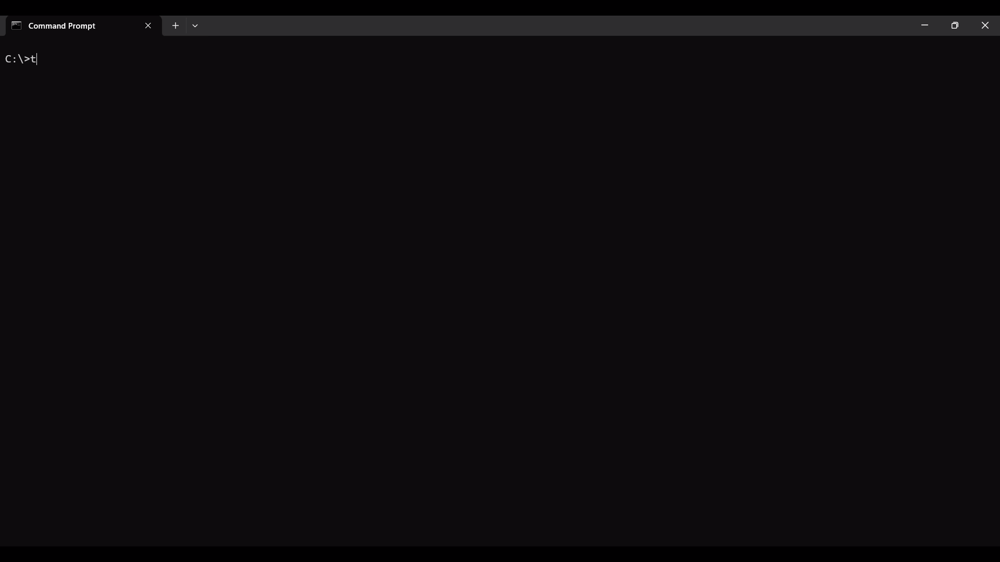

# Tasker CLI 

A simple and efficient command-line task manager built with Python. Manage your to-do lists directly from your terminal.


---

## Table of Contents

- [Features](#features)
- [Installation](#installation)
- [Usage](#usage)
- [Demo](#demo)
- [File Structure](#file-structure)
- [Contributing](#contributing)
- [Future Enhancements](#future-enhancements)
- [License](#license)

---

##  Features

-  **Add, Update, & Delete Tasks**: Full CRUD functionality for your tasks.
-  **Track Task Status**: Mark tasks as `todo`, `in-progress`, or `done`.
-  **Tabular View**: View all your tasks in a clean, organized table format, powered by `tabulate`.
-  **Filter Tasks**: Easily list tasks by their status to focus on what matters.
-  **Persistent Storage**: Your tasks are saved locally in a `tasks.json` file, so you never lose your data.

---


##  Installation

To get Tasker CLI running on your local machine, you can clone the repository and install it using `pip`. This will automatically install all dependencies and make the `tasker` command available in your terminal.

**Prerequisites:**
- Python 3.8 or higher
- Pip
- Git

**Steps:**

1.  **Clone the repository:**
    ```bash
    git clone [https://github.com/DeepuNoob39/Task-Tracker.git](https://github.com/DeepuNoob39/Task-Tracker.git)
    ```

2.  **Navigate to the project directory:**
    ```bash
    cd Task-Tracker
    ```

3.  **Install the project in editable mode:**
    Installing with the `-e` flag (editable) is highly recommended. It creates the `tasker` command on your system while allowing you to modify the source code and see changes immediately without reinstalling.
    ```bash
    pip install -e .
    ```

4.  **Verify the installation:**
    You should now be able to run the `tasker` command from anywhere in your terminal.
    ```bash
    tasker --help
    ```

---

##  Usage

All commands follow the `tasker <command> [arguments] [options]` format.

### Add a new task
Adds a new task with the status `todo` by default.

```bash
tasker add "Create a new project README"
```

### List all tasks
Displays all tasks in a table.

```bash
tasker list
```

### Filter tasks by status
List tasks that match a specific status: todo, in-progress, or done.

```bash
tasker list --status done
```

### Update a task
Update the title or status of an existing task using its ID.

```bash
# Update the title
tasker update 1 --title "Create an amazing project README"

# Update the status
tasker update 1 --status in-progress
```
### Mark a task as done
A convenient shortcut to mark a task as done.

```bash
tasker done 1
```

### Delete a task
Permanently remove a task using its ID.

```bash
tasker delete 2
```

##  Demo





## File Structure
Here is an overview of the Project's file structure
Task-Tracker/
├── assets/
│   └── demo.gif            # Demo GIF for the README
│
├── tasker/
│   ├── __init__.py         # Makes 'tasker' a Python package
│   └── cli.py              # Main application logic for the CLI
│
├── .gitignore              # Specifies files for Git to ignore
├── LICENSE                 # Your project's MIT License file
├── README.md               # The project's README file
└── setup.py                # Configuration for making the project installable


##  Contributing

Contributions are welcome! If you'd like to contribute, please follow these steps:

1.  **Fork the repository** on GitHub.
2.  **Clone your forked repository** to your local machine:
    ```bash
    git clone https://github.com/DeepuNoob39/Task-Tracker.git
    ```
3.  **Create a new branch** for your feature or bug fix:
    ```bash
    git checkout -b feature/your-feature-name
    ```
4.  **Make your changes** and commit them with a clear, descriptive message:
    ```bash
    git commit -m "feat: Implement amazing new feature"
    ```
5.  **Push your changes** to your forked repository:
    ```bash
    git push origin feature/your-feature-name
    ```
6.  **Open a Pull Request** from your branch to the `main` branch of the original repository.

Please ensure your code follows the project's coding style and includes tests for any new functionality.

##  Future Enhancements

Here are some ideas for future improvements:

- [ ] **Task Priorities**: Add support for `high`, `medium`, and `low` priority levels.
- [ ] **Due Dates**: Implement due dates and reminders for tasks.
- [ ] **Sub-tasks**: Allow tasks to have nested sub-tasks.
- [ ] **Alternative Storage**: Add support for other storage backends like SQLite.
- [ ] **Configuration File**: Create a config file (`~/.tasker/config.ini`) for user preferences.

---

##  License

This project is licensed under the MIT License. See the [LICENSE](LICENSE) file for more details.